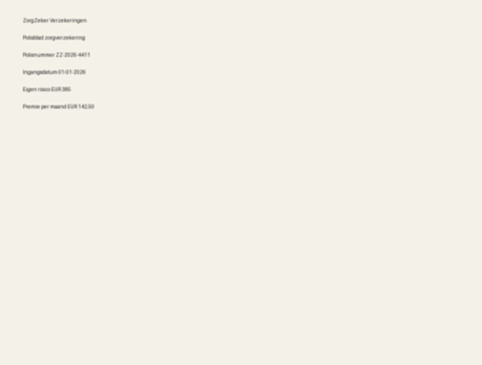

# Bewaarhet visuele review

Deze map bevat kopieen van testdocumenten die fout of onzeker zijn beoordeeld.

- Failed: 0
- Uncertain: 1

## Documenten

### lowres_health_policy

- Bestand: [lowres_health_policy.png](uncertain/lowres_health_policy.png)
- Details: [lowres_health_policy.md](uncertain/lowres_health_policy.md)
- Categorie: verwacht `overig`, voorspeld `overig`
- Confidence: 0.25
- Reden opname: lage classifier confidence (0.25); document valt in overig terwijl herkenbare termen aanwezig zijn; AI fallback had inhoudelijk gekund maar is niet gebruikt
- Classifier reason: contract score lacked contract evidence; fallback not called

